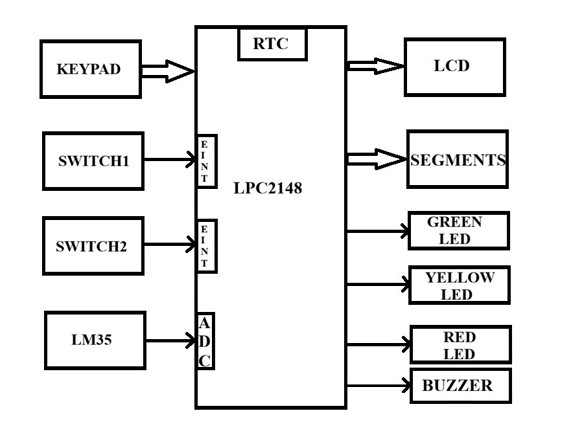
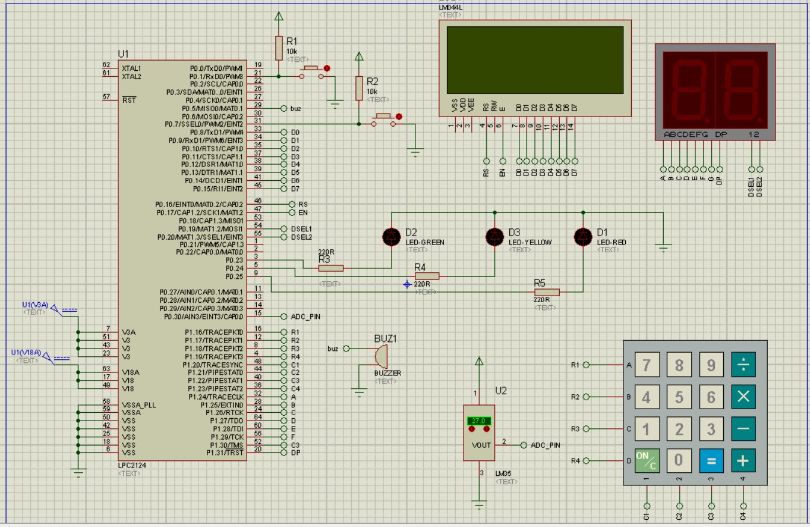

# Smart Exam Hall Monitoring and Management System

An embedded systems project designed to monitor and manage an examination hall using an **LPC21xx ARM7 microcontroller**. The system provides secure exam configuration, real-time clock management, exam countdown monitoring, pause/resume functionality, temperature monitoring, visual status indicators, and an alarm when the examination duration expires.

---

## 📌 Project Overview

The **Smart Exam Hall Monitoring and Management System** automates important examination-hall monitoring tasks.

The system allows an authorized user to:

* Configure the RTC time and date
* Configure the examination start time
* Set the examination duration
* Change the administrator password
* Monitor the remaining examination time
* Pause and resume an active examination
* Monitor hall temperature using an LM35 sensor
* Display information on an LCD
* Display the remaining examination time using a dual 7-segment display
* Indicate examination status using LEDs
* Activate a buzzer when the examination ends
* Protect system configuration using a 4-digit password

The project is implemented in **Embedded C** and directly interfaces with microcontroller peripherals.

---

## ✨ Features

### 🔐 Password Protection

System configuration is protected by a 4-digit password.

After authentication, the administrator can access:

1. EDIT RTC TIME
2. EDIT EXAM TIME
3. EDIT PASSWORD
4. EXIT

The password can also be changed through the keypad.

---
###Block Diagram

---
### Circuit Diagram

---

### ⏰ RTC Time and Date Management

The built-in RTC functionality is used to maintain the current:

* Hour
* Minute
* Second
* Date
* Month
* Year

The administrator can modify the RTC settings through the keypad.

Time is displayed in the format:

HH:MM:SS

Date is displayed in the format:

DD/MM/YYYY

---

### 📝 Exam Scheduling

The administrator can configure:

* Exam start hour
* Exam start minute
* Exam duration

The system waits until the configured exam start time and automatically starts the countdown.

---

### ⏳ Exam Countdown Timer

Once the configured exam time is reached, the system calculates and displays the remaining examination duration.

The remaining time is displayed using a **dual 7-segment display**.

The countdown also takes the paused duration into account.

---

### ⏸️ Exam Pause / Resume

An external interrupt is used to pause and resume an ongoing examination.

When the exam is paused:

* The countdown is stopped
* The last remaining time is retained
* The paused duration is tracked

When the exam resumes:

* The paused duration is excluded from the elapsed examination time
* The countdown continues from the previous remaining time

---

### 🌡️ Temperature Monitoring

An **LM35 temperature sensor** is connected through the ADC.

The measured temperature is displayed on the LCD in degrees Celsius.

Example:

temp 27.50°C

The ADC converts the sensor voltage into a digital value, which is then converted into temperature.

---

### 🚦 LED Status Indication

The system uses three LEDs to indicate the remaining examination time.

| Remaining Time       | Indicator |
| -------------------- | --------- |
| More than 15 minutes | LED 3     |
| 2–15 minutes         | LED 2     |
| 1 minute or less     | LED 1     |
| Exam finished        | Buzzer    |

This provides a simple visual indication of the examination status.

---

### 🔔 Exam Completion Alarm

When the remaining exam time reaches zero:

dur == 0

the system activates the buzzer for approximately 10 seconds.

The examination is then marked as no longer running.

---

## 🧩 System Components

The project uses the following hardware interfaces:

| Component              | Purpose                                |
| ---------------------- | -------------------------------------- |
| LPC21xx ARM7 MCU       | Main controller                        |
| 16×2 LCD               | User interface and information display |
| 4×4 Matrix Keypad      | User input                             |
| RTC Peripheral         | Time and date management               |
| Dual 7-Segment Display | Exam countdown display                 |
| LM35                   | Temperature sensing                    |
| ADC                    | Analog temperature measurement         |
| LED 1                  | Critical remaining-time indication     |
| LED 2                  | Medium remaining-time indication       |
| LED 3                  | Normal remaining-time indication       |
| Buzzer                 | Exam completion alarm                  |
| External Interrupt 0   | Configuration/access trigger           |
| External Interrupt 2   | Exam pause/resume                      |

---

## 🔌 Pin / Peripheral Configuration

The project defines the hardware interfaces in `Macros.h`.

### LCD

LCD Data     → P0.8 – P0.15
LCD RS       → P0.16
LCD EN       → P0.17

### Matrix Keypad

Rows:
ROW0 → P1.16
ROW1 → P1.17
ROW2 → P1.18
ROW3 → P1.19

Columns:
COL0 → P1.20
COL1 → P1.21
COL2 → P1.22
COL3 → P1.23

### 7-Segment Display

Segment data → P1.24 – P1.31

Digit select:
DSEL1 → P0.19
DSEL2 → P0.20

### ADC / LM35

The LM35 temperature sensor is read through **ADC Channel 3**.

LM35 → ADC Channel 3

### LEDs and Buzzer

Buzzer → P0.5

LED1   → P0.23
LED2   → P0.24
LED3   → P0.25

---

## 🏗️ Software Architecture

The project is divided into reusable modules.
```text
Smart Exam Hall Monitoring System
│
├── Smart_Exam_Hall_Monitoring_and_Management_System.c
│   └── Main program and external interrupt handling
│
├── definations_project.c
│   ├── Password authentication
│   ├── RTC configuration
│   ├── Exam configuration
│   ├── Password modification
│   └── RTC display functions
│
├── declaration_project.h
│   └── Project-level function declarations
│
├── project.c
│   ├── Delay functions
│   ├── LCD driver
│   ├── 7-segment driver
│   ├── Matrix keypad driver
│   ├── ADC driver
│   └── LM35 temperature driver
│
├── project.h
│   └── Peripheral function declarations
│
├── declaration.h
│   └── Peripheral declarations
│
└── Macros.h
    └── Hardware definitions and register macros
```
---

## 🔄 System Flow

                ┌──────────────────────┐
                │      Power ON        │
                └──────────┬───────────┘
                           │
                           ▼
                ┌──────────────────────┐
                │ Initialize Hardware  │
                │ LCD / Keypad / ADC   │
                │ RTC / 7-Segment      │
                └──────────┬───────────┘
                           │
                           ▼
                ┌──────────────────────┐
                │ Display Welcome      │
                │ "SMART EXAM"         │
                └──────────┬───────────┘
                           │
                           ▼
                ┌──────────────────────┐
                │ Wait for Configuration│
                │ / Exam Start Time    │
                └──────────┬───────────┘
                           │
                           ▼
                ┌──────────────────────┐
                │ Check Exam Start     │
                │ Time                 │
                └──────────┬───────────┘
                           │
                    ┌──────┴──────┐
                    │             │
                  Not Yet       Started
                    │             │
                    │             ▼
                    │   ┌─────────────────┐
                    │   │ Start Countdown │
                    │   └────────┬────────┘
                    │            │
                    │            ▼
                    │   ┌─────────────────┐
                    │   │ Display Remaining│
                    │   │ Time             │
                    │   └────────┬────────┘
                    │            │
                    │       ┌────┴────┐
                    │       │         │
                    │     Pause     Running
                    │       │         │
                    │       ▼         │
                    │    Resume       │
                    │       │         │
                    │       └────┬────┘
                    │            │
                    │            ▼
                    │   ┌─────────────────┐
                    │   │ Time Remaining  │
                    │   │ Reaches Zero   │
                    │   └────────┬────────┘
                    │            │
                    │            ▼
                    │   ┌─────────────────┐
                    │   │ Activate Buzzer │
                    │   └─────────────────┘
                    │
                    └─────────────────────

---

## 🖥️ User Interface

The LCD provides information such as:

SMART EXAM
MONITOR SYSTEM

During normal operation, the LCD displays information including:

HH:MM:SS
DD/MM/YYYY
temp XX.XX°C
pause time XX

The keypad is used to navigate menus and enter configuration values.

---

## 🔢 Keypad

The system uses a 4×4 matrix keypad with the following logical layout:

```text
+---+---+---+---+
| 1 | 2 | 3 | / |
+---+---+---+---+
| 4 | 5 | 6 | * |
+---+---+---+---+
| 7 | 8 | 9 | - |
+---+---+---+---+
| c | 0 | = | + |
+---+---+---+---+
```

The numeric keys are used for entering values.

Special keys include:

c → Cancel / Return
= → Confirm
+ → Backspace / Delete last digit


---

## 🔐 Password Authentication Flow

The administrator access sequence is:

```text

External Interrupt
       │
       ▼
Enter Password
       │
       ▼
Password Correct?
   ┌───┴───┐
   │       │
  Yes      No
   │       │
   ▼       ▼
Access   Retry
Menu     Limited
   │
   ▼
Configuration
```
The password input is masked on the LCD, allowing only asterisks to remain visible after each entered digit.

---

## ⚙️ Main Configuration Menu

After successful authentication:

1. EDIT RTC TIME
2. EDIT EXAM TIME
3. EDIT PASSWORD
4. EXIT

### RTC Menu

1. TIME
2. DATE
3. EXIT

### Exam Menu

1. EXAM TIME
2. DURATION
3. EXIT

### Password

The administrator can configure a new 4-digit password.

---

## 🛠️ Technologies Used

* **Embedded C**
* **ARM7 / LPC21xx**
* **GPIO**
* **RTC**
* **ADC**
* **External Interrupts**
* **LCD Interface**
* **4×4 Matrix Keypad**
* **7-Segment Display**
* **LM35 Temperature Sensor**
* **LED Indicators**
* **Buzzer**

---

## 📂 Project Files

| File                                                 | Description                                                 |
| -------------------------------------------------- | ----------------------------------------------------------- |
| Smart_Exam_Hall_Monitoring_and_Management_System.c | Main application, exam timer logic and interrupt handlers   |
| definations_project.c                              | Password, RTC, exam configuration and display logic         |
| declaration_project.h                              | Project function declarations                               |
| project.c                                          | LCD, keypad, ADC, 7-segment, LM35 and delay implementations |
| project.h                                          | Peripheral function declarations                            |
| declaration.h                                      | Peripheral declarations                                     |
| Macros.h                                           | Hardware pin definitions, data types and register macros    |

---

## 🚀 How to Build

This is an embedded C project intended for an **LPC21xx ARM7 microcontroller environment**.

### 1. Clone the repository

git clone https://github.com/<your-username>/Smart-Exam-Hall-Monitoring-and-Management-System.git

### 2. Open the source files in your ARM7/LPC21xx development environment

Add the following source files to the project:

Smart_Exam_Hall_Monitoring_and_Management_System.c
definations_project.c
project.c


Add the required header files:

Macros.h
declaration.h
declaration_project.h
project.h

### 3. Configure the target microcontroller

Select the appropriate **LPC21xx ARM7** target used by your hardware setup.

Configure the compiler, linker and startup code according to the selected MCU development environment.

### 4. Compile the project

Build the project and resolve any target-specific startup or linker configuration requirements.

### 5. Program the microcontroller

Flash the generated firmware onto the target LPC21xx development board using the programmer/debugger appropriate for your hardware.

---

## 🧪 Working Principle

The system continuously monitors the RTC and compares the current time with the configured examination start time.

When:


uhour == HOUR && umin == MIN

the examination begins.

The system records the exam start time and calculates elapsed time in minutes.

The remaining duration is calculated as:

Remaining Time =
Exam Duration - Elapsed Time + Paused Time

When the exam is paused, the pause timestamp is recorded. When the exam resumes, the accumulated pause duration is excluded from the elapsed examination time.

The remaining time is then displayed on the dual 7-segment display.

---

## 📊 Examination Status

The system provides multiple forms of feedback:

```text

                 EXAM STATUS
                     │
       ┌─────────────┼─────────────┐
       │             │             │
       ▼             ▼             ▼
   15+ minutes    2–15 minutes   ≤1 minute
       │             │             │
       ▼             ▼             ▼
     LED3          LED2          LED1
                     │
                     ▼
               Time = 0
                     │
                     ▼
                  BUZZER
```

---

## 🌡️ Temperature Calculation

The ADC converts the LM35 output voltage into a digital value.

The project calculates the sensor voltage using:

(eAR = 3.3 / 1024) * ADC_Value

The LM35 temperature is then calculated as:

Temperature(°C) = Voltage × 100

The result is displayed on the LCD with two decimal places.

---

## 🔒 Input Validation

The project performs validation for several configuration values.

Examples include:

### RTC Hour

0-23

### RTC Minute

0 – 59

### Date

1 - 31

### Month

1 – 12

### Password

1000 – 9999

This ensures that the password contains exactly four digits.

---

## 🎯 Applications

This project can be adapted for:

* Smart examination halls
* Educational institutions
* Examination monitoring systems
* Embedded automation projects
* Academic mini-projects
* ARM7 microcontroller demonstrations
* Real-time monitoring applications
* Embedded systems laboratory projects

---

## 🔮 Future Improvements

Possible improvements include:

* Add EEPROM/Flash storage for password and exam settings
* Store examination logs
* Add multiple exam schedules
* Add an attendance management module
* Add RFID-based student identification
* Add biometric authentication
* Add multiple temperature sensors
* Add a real-time calendar with proper month/day validation
* Add a graphical display
* Add UART/Bluetooth/Wi-Fi connectivity
* Send alerts to a monitoring system
* Add power-failure recovery
* Add non-volatile storage for exam configuration
* Add automatic report generation

---

## ⚠️ Notes

This repository contains low-level embedded C source code that directly accesses LPC21xx hardware registers.

The exact hardware board, clock configuration, compiler settings, startup code, linker configuration, and programming procedure may need to be adapted to the specific LPC21xx development board being used.

The project should be tested on the intended hardware before deployment in a real examination environment.

---

## 👨‍💻 Project Structure

```text
Smart-Exam-Hall-Monitoring-and-Management-System/
│
├── Smart_Exam_Hall_Monitoring_and_Management_System.c
├── definations_project.c
├── declaration_project.h
├── declaration.h
├── Macros.h
├── project.c
└── project.h
```

## ⭐ Acknowledgement

This project demonstrates the integration of multiple embedded-system peripherals into a single real-time examination monitoring and management application.

If you find this project useful, consider giving the repository a ⭐ on GitHub.
